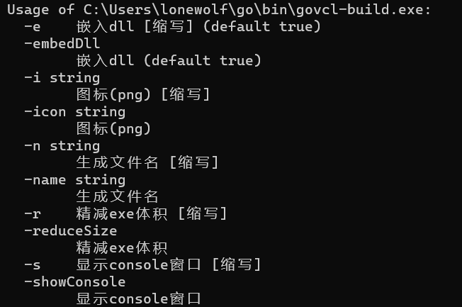

# govcl-build
帮助 [govcl](https://github.com/ying32/govcl) 生成windows版可执行程序(exe)。

## 特色
- 直接使用png图片作为程序图标
- 生成的程序适应高DPI屏幕(2k, 4k屏)

## 用法

说明：
- 图标如果没有指定则使用icon.png，如果没有则使用原govcl的图标
- 切记，程序不可引入 "github.com/ying32/govcl/pkgs/winappres"包
- 生成的exe文件名默认为项目文件夹名称
- 精减exe体积使用的参数是 -ldflags="-s -w"
- 默认嵌入dll文件到exe中

## 使用示例
```
govcl-build
govcl-build -i="myicon.png" -n="我的 程序"
govcl-build -r -n="mytools"
govcl-build -s=false
```
